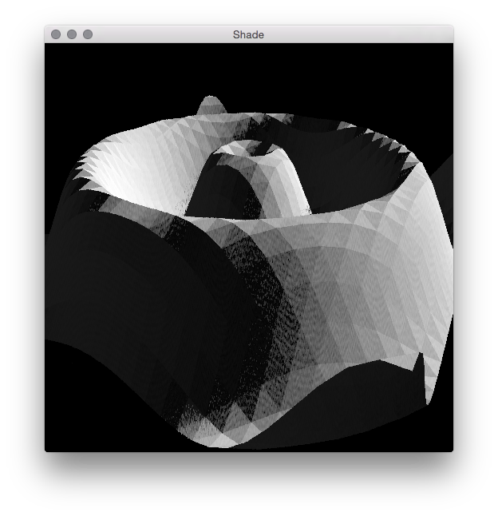
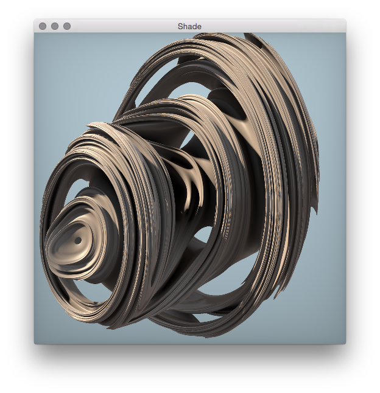
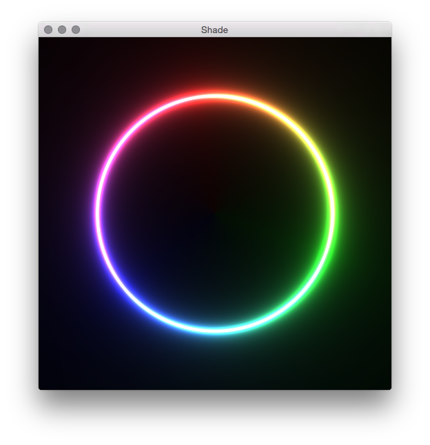

# shade
shader-toy-like fragment shader development assistant tool. blockchain.

## what
it's like shader-toy, but with basically no features of shader-toy. but you can run it off-line, and not in a browser. it has only one dependancy - SDL2. this is not intended to be a standalone tool per se, but rather just something that you can easily modify (and extend, if required) to prototype a shader.

## usage
modify `fragment.glsl` as you see fit, checkout your shader with `make`. the program takes no arguments - just edit the code :)

## requirements
### sdl2
install with your favorite package manager or installation method. most sane installation methods put the headers in your default include path. no need for any of this `pkg-config` nonsense.

## fragment shader
### format
the code is designed to handle fragment shaders of the form;

```glsl
vec4
fragment
(vec2 p)
{
  vec4 result = /* some math */;

  return result;
}
```

### input
a `vec2` containing the fragment's normalised coordinates in the viewport - i.e between 0 and 1, in `x` and `y`. this is different to shadertoy, which gives you screen coordinates.

### output
a `vec4` representing the colour in RGBA format.

### globals
1. `uTime` - a `float` containing the number of seconds elapsed since the program began execution.
2. `uSize` - a `vec2` containing the current dimensions of the viewport.

## examples
there are some examples ~~stolen~~ borrowed from shadertoy included with this - they should be somewhat accurate renditions of the shaders found there.

to try these out for yourself, just copy over `fragment.glsl` with them, e.g

```
$ cp examples/light-ring.glsl fragment.glsl
$ make
```

### displacement mapping
from [shadertoy](https://www.shadertoy.com/view/MtBSzd):



### julia quarternion
from [shadertoy](https://www.shadertoy.com/view/MsfGRr):



### light ring
from [shadertoy](https://www.shadertoy.com/view/XdlSDs):




## todo
1. consider windows support
1. add some more features
1. ???
1. PROFIT
1. retire early 2000s memes from general usage.
